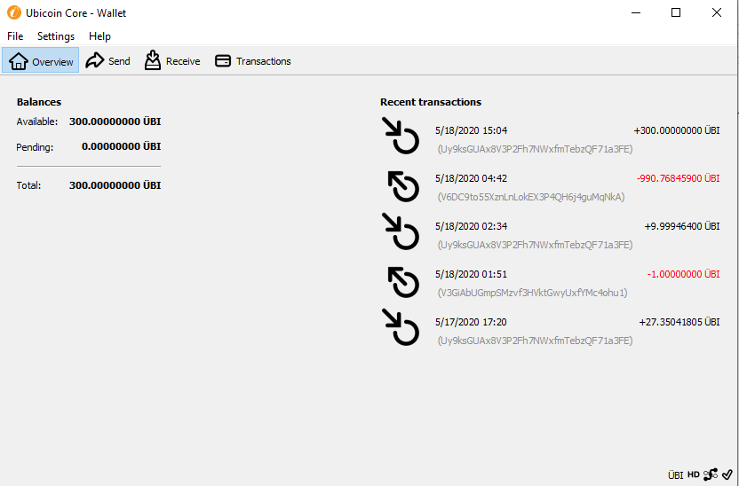

# Ubicoin
Ubicoin is an experimental digital currency that enables instant payments to anyone, anywhere in the world.
Ubicoin uses peer-to-peer technology to operate with no central authority: managing transactions and issuing money are carried out collectively by the network. Ubicoin Core is the name of open source software which enables the use of this currency.

We built this coin with the aim of opening up jobs like miners, traders, and many other sources of income. Our team consists of volunteers who support the success of this project even though it will take a long time, but we are fully convinced that one day we will be one of the candidates to replace Bitcoin.

#
<p align="center">
  
</p>
#
<p align="center">
  
</p>

License
-------

Litecoin Core is released under the terms of the MIT license. See [COPYING](COPYING) for more
information or see https://opensource.org/licenses/MIT.

Testing
-------

Testing and code review is the bottleneck for development; we get more pull
requests than we can review and test on short notice. Please be patient and help out by testing
other people's pull requests, and remember this is a security-critical project where any mistake might cost people
lots of money.

Coin | Information
:--|:--
Total Supply | 21.000.000 UBI
Block Reward | 50 UBI
Block Time | 15 Minutes
Block diff adjustment | 2016 Block
Halving | 210000 Block
Segwit | Active

Address Prefix | Started
:--|:--
Normal | V
Legancy | U
Segwit/Bench | Ubi

## Links

* [MiningPoolStats](https://miningpoolstats.stream/ubicoin)
* [NewRewardCoins](https://newrewardcoins.com/coin/ubi/)
* [Block Explorer](http://chain.ubinodes.online)

## Known Mining Pools

* [SmithPool.net](https://smithpool.net/)
```
-a scrypt -o stratum+tcp://stratum.smithpool.net:6540-u Uy9ksGUAx8V3P2Fh7NWxfmTebzQF71a3FE -p c=UBI
```
* [XpoolX.com](https://xpoolx.com/)
```
-a scrypt -o stratum+tcp://mining.xpoolx.com:2020 -u Uy9ksGUAx8V3P2Fh7NWxfmTebzQF71a3FE -p c=UBI,mine=UBI
```
* [Bsod.pw](https://bsod.pw/en/pool/dashboard/UBI/)
```
-a scrypt -o stratum+tcp://pool.bsod.pw:2650 -u Uy9ksGUAx8V3P2Fh7NWxfmTebzQF71a3FE
```
SOLO
```
-a scrypt -o stratum+tcp://pool.bsod.pw:2650 -u Uy9ksGUAx8V3P2Fh7NWxfmTebzQF71a3FE -p m=solo
```
PARTY
```
-a scrypt -o stratum+tcp://pool.bsod.pw:2650 -u Uy9ksGUAx8V3P2Fh7NWxfmTebzQF71a3FE m=party.yourpassword
```
* [0769.it](https://www.0769.it/)
```
-a scrypt -o stratum+tcp://us.0769.it:3431 -u Uy9ksGUAx8V3P2Fh7NWxfmTebzQF71a3FE -p c=UBI
```

## Social Media

* [Bitcointalk](https://bitcointalk.org/index.php?topic=5247767.0)
* [Twitter](https://twitter.com/UbicoinOfficial)
* [Facebook](https://www.facebook.com/UbicoinOfficials/)
* [Telegram Channel](https://t.me/ubitchan)
* [Global Group](https://t.me/ubistate)
* [Bitcointalk](https://bitcointalk.org/index.php?topic=5247767.0)
* [Bitcointalk](https://bitcointalk.org/index.php?topic=5247767.0)

## BOT

* [Telegram Bot](https://t.me/ubicoin_bot)

Translations
------------

We only accept translation fixes that are submitted through [Bitcoin Core's Transifex page](https://www.transifex.com/projects/p/bitcoin/).
Translations are converted to Litecoin periodically.

Translations are periodically pulled from Transifex and merged into the git repository.

**Important**: We do not accept translation changes as GitHub pull requests because the next
pull from Transifex would automatically overwrite them again.
